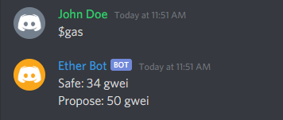

# Discord Bot

A discord bot that provides Ethereum blockchain data.

## Tools used:
* Python
* APIs

## Current Commands:
* $gas
    * Retrieves current Ethereum gas prices and posts them to discord.
* $eth
    * Retrieves the current price of Ethereum and posts it to discord.

## Example Usage: 

## Data Sources:
Ethereum data provided by [Etherscan.io](https://etherscan.io/).
